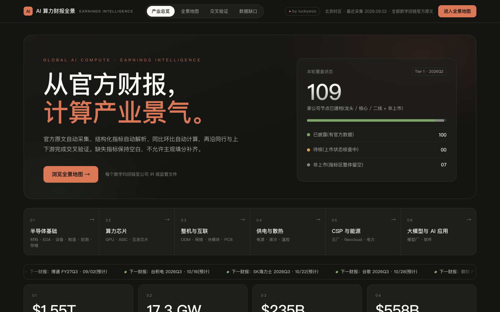
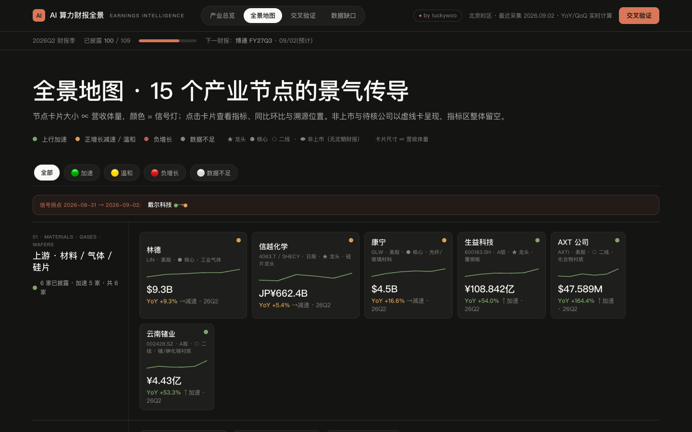

# AI 算力财报全景地图

一个基于公司官方财报与公告构建的 AI 算力产业链景气观察工具。项目用纯 HTML、CSS 和 JavaScript 实现，无后端、无构建步骤，可直接在浏览器中运行。

## 界面预览

### 产业总览



### 全景地图



## 这个 Map 能做什么

- **产业总览**：覆盖材料、设备、晶圆制造、存储、AI 芯片、服务器、光互联、PCB、供电散热、云厂等 15 个产业环节。
- **财报跟踪**：展示公司营收、净利润、毛利率、资本开支、订单和产能等结构化指标。
- **景气信号**：根据公开规则自动计算营收同比变化及加速情况，并显示绿、黄、红、灰四种信号。
- **上下游验证**：通过 GPU、光模块、电力和中国算力链等关系交叉对照财报数据；发现背离时只标记，不主观调和。
- **公司详情**：点击公司卡片可查看历史季度指标、同比/环比、披露来源及原文链接。
- **数据缺口**：未披露或尚未采集的数据保持空白，并集中展示缺口，不使用估算值补齐。
- **Capex 与产能监测**：跟踪主要云厂资本开支，以及北美 AI 数据中心已投运、在建和规划容量。

## 当前覆盖

截至 2026-09-12：

- 109 家公司节点，覆盖 15 个产业环节
- 100 家公司已有结构化数据（99 家最新到 2026Q2，甲骨文到 2026Q3）
- 638 条公司季度/月度指标记录
- 569 条披露来源
- 11 个北美 AIDC 容量项目（仅收录有官方容量披露的项目）
- 76 行北美 AIDC 州级建设图谱（截至 2026-09-07）

## 页面说明

- `index.html`：产业总览、核心统计、云厂 Capex、时滞关系和景气概览。
- `map.html`：15 个产业节点的全景地图、公司详情、交叉验证和数据缺口墙。
- `aidc-us.html`：北美 AIDC 州级建设图谱。按容量口径分桶（A 核心 / A-1 剔除核电 PPA / B 远景装机 / C 发电侧 / F 存量市场 / G 全球组合 / E 无数值 / H 已终止），**仅 A 口径计入州级容量与地图底色**，其余层单列且不可与 A 相加。

## 本地运行

可以直接双击 `index.html`，也可以在项目目录启动本地静态服务器：

```bash
python3 -m http.server 8000
```

然后访问：

```text
http://localhost:8000
```

## 景气信号规则

- 🟢 营收同比增长超过 20%，且增速较上季度加快
- 🟡 营收正增长但减速，或同比增速位于 0%–20%
- 🔴 营收同比负增长
- ⚪ 数据不足，无法计算

同比、环比和信号灯均由页面根据原始数据实时计算，不在数据文件中预存结果。

## 数据纪律

1. 数据优先来自 SEC、巨潮资讯、公开资讯观测站、交易所公告或公司官方 IR。
2. 每个指标通过 `src` 关联到来源、原文地址、采集日期和披露位置。
3. 财务期间统一映射到自然季度；A 股半年报单季度数据按 `H1 - Q1` 推导，并保留计算说明。
4. 缺失数据保持空白，不使用模型记忆、插值或主观估算补齐。
5. 常规公司保留最新 4 个季度及上年同期 2 个季度（6 季滚动窗口）；超出窗口的旧季由 `node tools/prune-window.js` 修剪。台积电、广达、纬颖、英伟达、三星、SK 海力士等时滞分析公司保留 12 季，供首页错季叠加曲线使用。

详细口径见 [`data/schema.md`](data/schema.md)。

## 数据校验

更新 `data/*.js` 后必须运行：

```bash
node validate.js
node --test tests/calc.test.js
```

校验内容包括数据结构、来源引用、期间格式、指标单位和计算逻辑。出现来源白名单警告时，需要人工复核对应链接。

新一季入库后，滚动窗口会前移一季，需修剪掉滑出窗口的旧季（脚本会先复算比对，确认信号灯与窗口内数值不变才写入，并自动备份）：

```bash
node tools/prune-window.js --dry   # 预览将删除哪些季度
node tools/prune-window.js         # 执行修剪
```

## 项目结构

```text
.
├── index.html              # 产业总览
├── map.html                # 全景地图
├── aidc-us.html            # 北美 AIDC 州级建设图谱
├── styles.css              # 页面样式
├── js/                     # 计算、渲染和交互逻辑
├── data/                   # 公司、财报、来源、产能、估值与 AIDC 图谱数据
├── tools/                  # 数据采集、合并、窗口修剪与检查工具
├── tests/                  # 计算逻辑测试
├── pipeline/               # 数据采集管线约定
├── site/                   # 云端发布的纯前端快照
└── validate.js             # 数据完整性校验
```

## 说明

本项目用于产业研究和财报数据观察，不构成投资建议。云端页面是静态快照，本地数据更新后需要重新部署才能同步展示。
